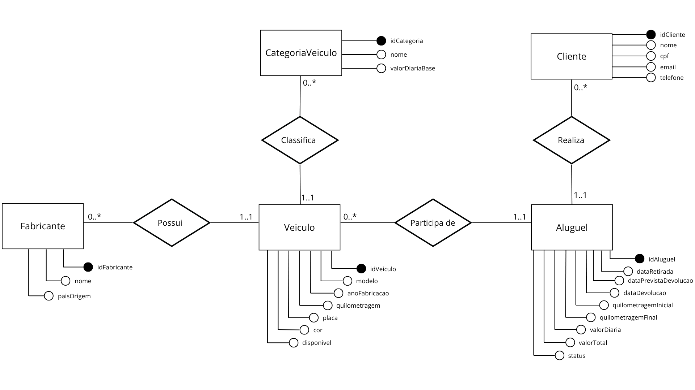

# Arquitetura da Solução

<p align="justify">
A arquitetura da solução foi estruturada seguindo o modelo cliente-servidor, no qual o sistema backend é responsável por disponibilizar uma API RESTful para comunicação com aplicações clientes, como interfaces web ou mobile. Essa abordagem permite uma separação clara de responsabilidades, favorecendo escalabilidade, manutenção e reutilização do sistema.
</p>

<p align="justify">
A aplicação é composta por duas camadas principais: o back-end, responsável pela lógica de negócio e acesso a dados, e o banco de dados relacional, responsável pela persistência das informações. A comunicação entre cliente e servidor ocorre por meio de requisições HTTP, utilizando o formato JSON para troca de dados.
</p>

<p align="justify">
O back-end foi desenvolvido utilizando ASP.NET Core Web API, sendo responsável pelo processamento das requisições, validação dos dados, controle das operações e integração com o banco de dados. A aplicação segue uma estrutura organizada em camadas, separando modelos de dados, contexto de banco e controladores.
</p>

<p align="justify">
O banco de dados utilizado é o SQL Server Express, que armazena informações relacionadas a fabricantes, categorias de veículos, veículos, clientes e operações de aluguel. O acesso aos dados é realizado por meio do Entity Framework Core, utilizando o padrão ORM (Object-Relational Mapping), que permite mapear classes C# para tabelas do banco de dados.
</p>

---

## Estrutura do Projeto

<p align="justify">
O projeto foi organizado de forma modular, seguindo boas práticas de desenvolvimento backend. A estrutura principal é composta pelas seguintes camadas:
</p>

- **Models**: Contém as classes de entidades que representam as tabelas do banco de dados.
- **Data**: Contém o `AppDbContext`, responsável pela configuração e comunicação com o banco de dados.
- **Controllers**: Responsável por expor os endpoints da API e tratar as requisições HTTP.
- **Configuração**: Arquivos como `Program.cs` e `appsettings.json`, responsáveis pela inicialização da aplicação e definição da conexão com o banco.

---

## Modelo de Dados

### Modelo Conceitual

<p align="justify">
O sistema foi modelado com base em um banco de dados relacional, no qual as entidades estão interligadas por meio de chaves primárias e estrangeiras, garantindo a integridade dos dados.
</p>

<p align="center">
  
</p>

---

### Modelo Físico

<p align="justify">
O modelo físico do banco de dados foi gerado automaticamente por meio do Entity Framework Core, utilizando migrations. Abaixo está um exemplo simplificado da estrutura das tabelas principais:
</p>

```sql
CREATE TABLE Fabricantes (
    IdFabricante INT PRIMARY KEY,
    Nome VARCHAR(100) NOT NULL,
    PaisOrigem VARCHAR(100)
);

CREATE TABLE CategoriasVeiculo (
    IdCategoria INT PRIMARY KEY,
    Nome VARCHAR(100) NOT NULL,
    ValorDiariaBase DECIMAL(10,2) NOT NULL
);

CREATE TABLE Veiculos (
    IdVeiculo INT PRIMARY KEY,
    Modelo VARCHAR(100) NOT NULL,
    AnoFabricacao INT NOT NULL,
    Quilometragem INT NOT NULL,
    Placa VARCHAR(20) NOT NULL,
    Cor VARCHAR(50),
    Disponivel BIT NOT NULL,
    IdFabricante INT,
    IdCategoria INT,
    FOREIGN KEY (IdFabricante) REFERENCES Fabricantes(IdFabricante),
    FOREIGN KEY (IdCategoria) REFERENCES CategoriasVeiculo(IdCategoria)
);

CREATE TABLE Clientes (
    IdCliente INT PRIMARY KEY,
    Nome VARCHAR(100) NOT NULL,
    Cpf VARCHAR(20) NOT NULL,
    Email VARCHAR(100) NOT NULL,
    Telefone VARCHAR(20)
);

CREATE TABLE Alugueis (
    IdAluguel INT PRIMARY KEY,
    DataRetirada DATETIME NOT NULL,
    DataPrevistaDevolucao DATETIME NOT NULL,
    DataDevolucao DATETIME,
    QuilometragemInicial INT NOT NULL,
    QuilometragemFinal INT,
    ValorDiaria DECIMAL(10,2) NOT NULL,
    ValorTotal DECIMAL(10,2) NOT NULL,
    Status VARCHAR(50) NOT NULL,
    IdCliente INT,
    IdVeiculo INT,
    FOREIGN KEY (IdCliente) REFERENCES Clientes(IdCliente),
    FOREIGN KEY (IdVeiculo) REFERENCES Veiculos(IdVeiculo)
);
